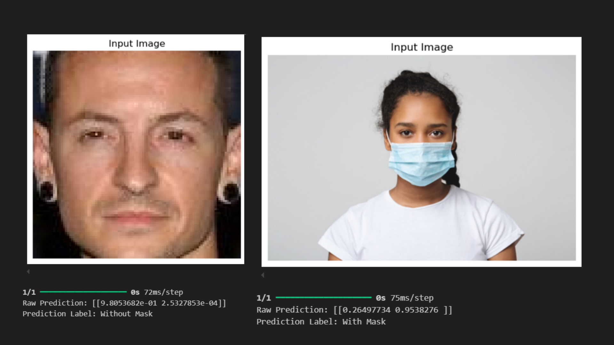

# 😷 Face Mask Detection using CNN

This project is a **computer vision model** that automatically detects whether a person is wearing a face mask or not in an image using **deep learning**.

Built using **Convolutional Neural Networks (CNN)** from scratch (no transfer learning!), the model achieves **98% accuracy** on real-world images. It’s lightweight, interpretable, and easy to deploy.

> Ideal for use cases such as health safety enforcement, smart surveillance systems, or embedded systems requiring mask compliance detection.

---

## 🔍 Problem Statement

During the COVID-19 pandemic, the use of masks became a public health necessity. Monitoring mask usage manually is inefficient and prone to error. This model provides an **automated solution** to distinguish between:

- **With Mask**
- **Without Mask**

Using only image input, it predicts the mask status with high confidence.

---

## 📦 Features

- Custom CNN built from scratch (no transfer learning)
- Achieves **~98% accuracy**
- Clean, interpretable training pipeline
- Manual image prediction support
- Ready for deployment & real-time extension

---

## 🧠 Model Summary

- Conv2D(32) → MaxPool  
- Conv2D(64) → MaxPool  
- Flatten → Dense(128) → Dropout  
- Dense(64) → Dropout → Output(2 neurons with Softmax)

---

🗂 Dataset source: [Kaggle – Face Mask Detection](https://www.kaggle.com/datasets/omkargurav/face-mask-dataset)

---

## 🛠️ Tech Stack

| Tool         | Purpose               |
|--------------|------------------------|
| TensorFlow   | Model building         |
| Keras        | CNN layers & training  |
| OpenCV       | Image I/O              |
| Matplotlib   | Visualization          |
| Seaborn      | Class distribution     |

---

## Results

| Metric    | Value |
| --------- | ----- |
| Accuracy  | 98%   |
| Precision | 98%   |
| Recall    | 98%   |
| F1-score  | 98%   |

